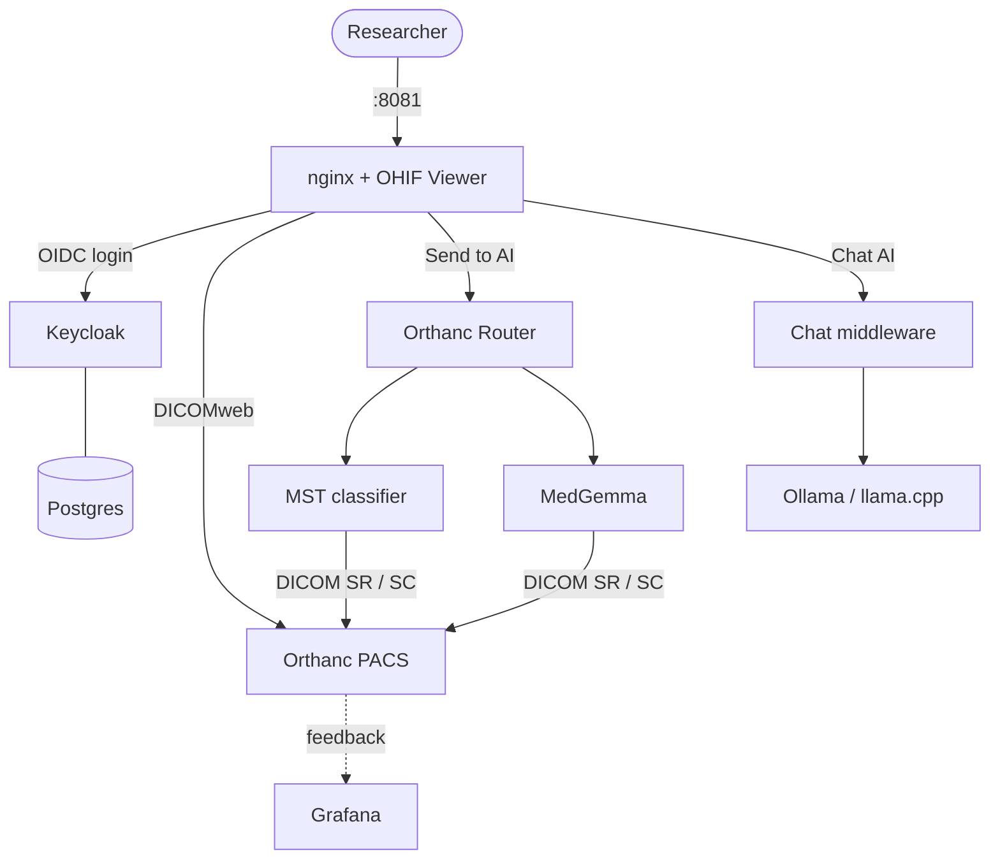

# Architecture

The ODELIA Viewer Platform is a set of Docker Compose services wired onto a single
`odelia-network`. A researcher interacts only with the **viewer**; everything else is
PACS storage, AI routing, model inference, authentication, and monitoring.

## Repository layout

```
.
├── docker-compose.yml      # the whole stack
├── config/                 # viewer (app-config.js), nginx, Keycloak realm, router config
├── orthanc/                # Orthanc PACS, AI routers, and ML services
│   ├── viewer/             #   Orthanc PACS instance + feedback API
│   ├── router/             #   Orthanc routing instance (UPS, WADO helpers)
│   └── MLIntegration/      #   MST, MedGemma, chat-middleware (+ shared) services
├── grafana/                # Grafana provisioning (datasource + feedback dashboard)
├── docs/                   # setup guides, model cards, hardening checklists
└── volumes/                # persistent data (Orthanc DB, feedback DB, GGUF models)  [gitignored]
```

## Services

`docker compose up` starts every service below except `llamacpp-server` (which is
profile-gated). Ports bind to `0.0.0.0` by default so others on your LAN can reach them —
set `BIND_HOST=127.0.0.1:` to restrict to loopback (see
[`restrict-to-localhost.md`](security/restrict-to-localhost.md)).

| Service | Role | Published port(s) |
| --- | --- | --- |
| **viewer** | ODELIA Viewer (OHIF) served behind nginx — the main UI | <http://localhost:8081> |
| **orthanc-viewer** | Local PACS: stores studies, serves DICOMweb, receives C-STORE | Web `:8000` · DICOM `:2000` |
| **keycloak** | OIDC authentication & user management | <http://localhost:8081/keycloak> (also `:8080` direct) — `admin` / `admin` |
| **postgres** | Keycloak database | none (internal only) |
| **orthanc-router-mst** / **-medgemma** | Route studies to an AI model and return DICOM results | HTTP `:8043` / `:8044` · DICOM `:4243` / `:4244` |
| **mst-classifier** | MST breast-MRI classification model | `:5556` |
| **medgemma-mri** | MedGemma vision-language model (needs `HF_TOKEN`) | `:5557` |
| **chat-middleware** | WebSocket chat about a study, backed by a local LLM | `:5560` |
| **llamacpp-server** | Optional llama.cpp chat backend (profile `llamacpp`) | `:8090` |
| **grafana** | Dashboards over the AI feedback database | <http://localhost:3000> (`admin` / `odelia`) |

## How a study flows through the stack



1. A study is **uploaded** into Orthanc (viewer upload, Orthanc web UI, or DICOM C-STORE).
2. From the viewer, the user **sends it to an AI router**, which orchestrates the model run
   over UPS-RS and hands the model WADO-RS URLs to fetch the DICOM.
3. The model performs **inference** and returns JSON results to the router.
4. The router wraps the results as **DICOM SR / Secondary Capture** and stores them back in
   Orthanc, where they appear next to the original images in the viewer.
5. Reader feedback is recorded and surfaced in **Grafana** dashboards.

For the day-to-day workflow (with screenshots), see [`usage/`](usage/). For the AI
integration contract and how to add your own model, see
[`usage/adding_custom_models.md`](usage/adding_custom_models.md).
