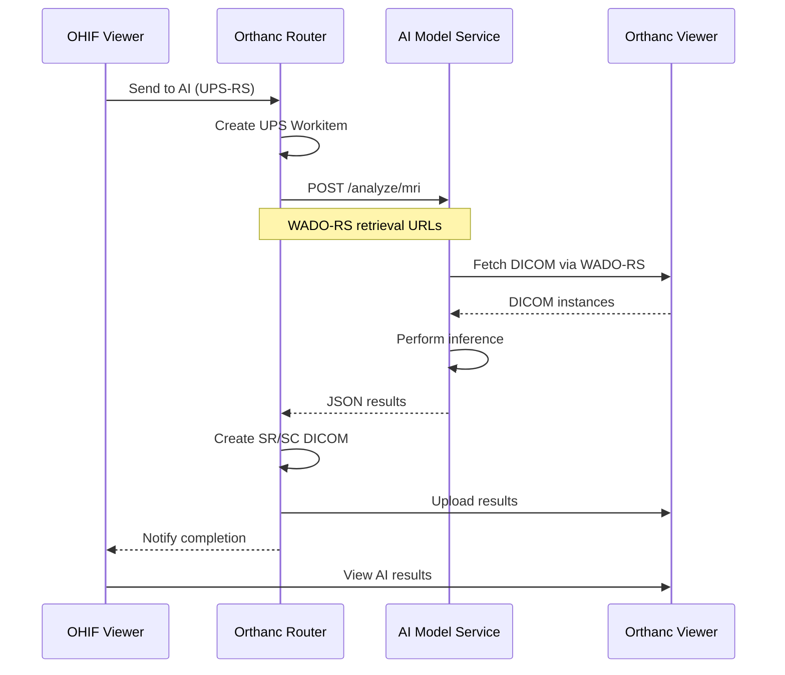

# Adding Custom AI Models to Odelia Viewer

This guide explains how to integrate custom AI models into the Odelia Viewer platform for medical image analysis.

## Overview

The Odelia Viewer provides a standardized architecture for integrating AI models that analyze medical images (specifically breast MRI studies). Your custom model will receive DICOM data via WADO-RS retrieval, perform inference, and return results that are automatically converted to DICOM format and displayed in the viewer.

## Architecture

The AI integration follows this workflow:



### Key Components

- **OHIF Viewer**: Frontend application where users interact with studies
- **Orthanc Router**: Orchestrates AI workflow via UPS-RS protocol
- **AI Model Service**: Your custom model (Flask microservice)
- **Orthanc Viewer**: DICOM storage that serves images via WADO-RS

## Input Format

Your AI model service must implement a `POST /analyze/mri` endpoint that accepts the following JSON format:

```json
{
  "wado_rs_retrieval": [
    {
      "retrieval_url": "http://orthanc-viewer:8042/dicom-web/studies/1.2.3.../series/1.2.3...",
      "study_uid": "1.2.840.113619.2...",
      "series_uid": "1.2.840.113619.2..."
    }
  ],
  "study_uid": "1.2.840.113619.2..."
}
```

### Field Descriptions

- `wado_rs_retrieval`: Array of series to retrieve
- `retrieval_url`: Full WADO-RS URL for retrieving the series
- `study_uid`: DICOM StudyInstanceUID
- `series_uid`: DICOM SeriesInstanceUID for each series

This format is sent by the orthanc-router's UPS processor when a user requests AI analysis.

## Output Format

Your model must return one of two JSON response formats. The router detects the format automatically and creates appropriate DICOM objects.

### Format 1: Bilateral Classification (Basic)

For models that return simple classification results:

```json
{
  "left": {
    "prediction": "Malignant",
    "confidence": 87.5
  },
  "right": {
    "prediction": "No lesion",
    "confidence": 65.2
  }
}
```

**Requirements:**
- `prediction`: String classification label (e.g. the bundled models return `No lesion` / `Benign` / `Malignant`)
- `confidence`: Numeric confidence score (0-100)

The router creates a **DICOM Structured Report (SR)** with these results.

### Format 2: Bilateral with Attention Maps (Advanced)

For models that return attention/heatmap visualizations:

```json
{
  "left": {
    "prediction": "Malignant",
    "confidence": 87.5
  },
  "right": {
    "prediction": "Benign",
    "confidence": 65.2
  },
  "attention_maps": {
    "data": "base64_encoded_numpy_array",
    "shape": [64, 256, 256],
    "dtype": "float32"
  }
}
```

**Additional Requirements:**
- `attention_maps.data`: Base64-encoded numpy array
- `attention_maps.shape`: Array dimensions [num_slices, height, width]
- `attention_maps.dtype`: Numpy dtype string (e.g., "float32")

The router creates both a **DICOM SR** and a **Multi-frame Secondary Capture (SC)** with heatmap overlays.

### Encoding Attention Maps

Example Python code to encode attention maps:

```python
import numpy as np
import base64

# Your attention maps as numpy array: shape (num_slices, height, width)
attention_array = np.random.rand(64, 256, 256).astype(np.float32)

# Encode for response
attention_maps = {
    "data": base64.b64encode(attention_array.tobytes()).decode('utf-8'),
    "shape": list(attention_array.shape),
    "dtype": str(attention_array.dtype)
}
```

## Shared Utilities Library

The `MLIntegration/shared/` package provides reusable utilities for building AI services. These utilities handle common tasks like DICOM retrieval, storage, and Orthanc communication.

### Installation

The shared package is automatically installed when you build your Docker image. In your Dockerfile:

```dockerfile
# Copy and install shared package
COPY shared/ ./shared/
COPY setup.py pyproject.toml ./
RUN pip install --no-cache-dir -e .
```

### Available Modules

#### 1. WADO-RS Retrieval (`shared.wado_retrieval`)

Retrieve DICOM instances via DICOMweb WADO-RS protocol.

```python
from shared.wado_retrieval import retrieve_via_wado_rs

# Retrieve DICOM datasets from WADO-RS URLs (the retrieval_url is self-contained)
datasets = retrieve_via_wado_rs(
    wado_rs_retrieval=[{
        "retrieval_url": "http://orthanc-viewer:8042/dicom-web/studies/.../series/...",
        "study_uid": "1.2.3...",
        "series_uid": "1.2.3..."
    }]
)

# datasets is a list[pydicom.Dataset]
for ds in datasets:
    print(ds.PatientName, ds.SeriesDescription)
```

#### 2. Configuration (`shared.config`)

The `StorageConfig` dataclass configures where retrieved DICOM is written.

```python
from shared.config import StorageConfig
from pathlib import Path

# Storage configuration
storage_config = StorageConfig(
    image_folder=Path("./images"),
    cleanup_on_start=True,
)
```

#### 3. DICOM Storage (`shared.dicom_storage`)

Save DICOM datasets to disk.

```python
from shared.dicom_storage import save_datasets_to_folder

# Save retrieved datasets to folder
dicom_folder = save_datasets_to_folder(
    datasets=datasets,
    series_uid="1.2.3...",
    storage_config=storage_config
)

# Returns Path to folder containing DICOM files
print(f"DICOM files saved to: {dicom_folder}")
```

#### 4. Exceptions (`shared.exceptions`)

`DicomRetrievalError` is raised when WADO-RS retrieval fails.

```python
from shared.exceptions import DicomRetrievalError

try:
    datasets = retrieve_via_wado_rs(wado_rs_retrieval)
except DicomRetrievalError as e:
    logger.error(f"Failed to retrieve DICOM: {e}")
```

> The `shared` package also ships `shared.dicom_storage` (path-safe series folder
> creation and dataset saving), `shared.timing_utils.time_operation`, and
> `shared.security_banner.print_security_banner`. Browse
> [`orthanc/MLIntegration/shared/`](../../orthanc/MLIntegration/shared/) for the full surface.

### Retrieval Strategies

The codebase uses a Strategy pattern for DICOM retrieval. See `MST-classification/retrieval_strategy.py` for reference:

```python
from retrieval_strategy import WadoRSRetrieval

# Create retrieval strategy
strategy = WadoRSRetrieval(
    wado_rs_retrieval=request_data["wado_rs_retrieval"],
    storage_config=storage_config
)

# Execute retrieval
dicom_folder, series_uid = strategy.retrieve()
```

## Preferred Path: Add a Roster Model to odelia-classification

If your model is a breast-MRI classifier, add it as a subunit of the
generalized `odelia-classification` service instead of writing a bespoke
service (the guide below). One image serves one model; everything else is
shared.

1. **Add a subunit** under `orthanc/MLIntegration/odelia-classification/models/<name>/`
   with a `loader.py` exposing `NAME`, `INPUT_SIZE`, and `create()` (lazy
   arch import). See `models/pimed/loader.py` for the minimal shape; the
   startup pre-flight forward will fail the container if the contract is
   violated.
2. **Build the image**, selecting your subunit and optionally baking weights:

   ```bash
   docker build -f orthanc/MLIntegration/odelia-classification/Dockerfile \
     --build-arg MODEL=<NAME> --build-arg WEIGHT_PATH=<path-or-empty> \
     -t stratifai/odelia-classification-<name> orthanc/MLIntegration
   ```

   Without `WEIGHT_PATH` the service runs init-only weights and logs it.
3. **Wire the router+service pair**: copy the blocks from
   [`docker-compose.model-template.yml`](../../docker-compose.model-template.yml)
   into `docker-compose.yml` and fill the placeholders. The template header
   lists every placeholder and the current host-port allocation; keep that
   table current. `MODEL_DEVICE` is required (`cpu` or `cuda`).
   Add `profiles: [odelia-models]` to both services unless the model should
   start with the default stack.
4. **Add a CI leg** in `.github/workflows/docker-build-push.yml`: one
   `matrix.include` entry in the **`build-preview`** job (image
   `odelia-classification-<name>`, kebab-case, `build_args: MODEL=<NAME>`).
   Give it `cache_scope: odelia-classification-shared` and a per-image
   `cache_to: type=gha,mode=max,scope=odelia-classification-<name>` --
   omitting `cache_to` silently disables cache export for that leg, it
   won't fail the build. Do **not** add the image to the `build` job or
   to the `promote` job's `images=` list yet: `build-preview` never
   pushes, so an entry there has no SHA manifest to promote. Once the
   model has trained weights (`WEIGHT_PATH` set) and its Docker Hub repo
   exists, publish it by moving the whole entry into the `build` job's
   matrix **and** adding the image to `images=` in the same change --
   doing only one half either 404s `promote` on that image or leaves it
   silently un-promoted.
5. **Register the endpoint in the viewer** (see
   [Register in Viewer](#step-7-register-in-viewer)).

## Implementation Guide

### Step 1: Create Model Service Directory

Create a new directory for your model under `MLIntegration/`:

```bash
cd orthanc/MLIntegration
mkdir your-model-name
cd your-model-name
```

### Step 2: Implement Flask Service

Create `app_refactored.py` with the following structure:

```python
"""
Your Model Service - Flask microservice
"""
import os
import logging
from pathlib import Path
from flask import Flask, request, jsonify
from flask_cors import CORS

from shared.config import StorageConfig
from config import YourModelConfig
from model_service import YourModelService
from exceptions import ModelNotLoadedError, InferenceError

# Set up logging
logging.basicConfig(level=logging.INFO)
logger = logging.getLogger(__name__)

# Initialize Flask app
app = Flask(__name__)
CORS(app)

# Global model service
model_service: YourModelService = None


def initialize_service():
    """Initialize configurations and model service"""
    global model_service

    # Load configurations from environment
    model_config = YourModelConfig.from_env()

    storage_config = StorageConfig(
        image_folder=Path(os.getenv("IMAGE_FOLDER", "./images")),
        cleanup_on_start=True,
    )

    # Create necessary directories
    os.makedirs(storage_config.image_folder, exist_ok=True)

    # Initialize model service
    model_service = YourModelService(model_config, storage_config)
    model_service.initialize_model()


@app.route("/health", methods=["GET"])
def health_check():
    """Health check endpoint"""
    return jsonify(model_service.get_health_status())


@app.route("/analyze/mri", methods=["POST"])
def analyze_mri():
    """
    Analyze MRI series using your model

    Expects:
    {
        "wado_rs_retrieval": [...],
        "study_uid": "1.2.3..."
    }

    Returns:
    {
        "left": {"prediction": "...", "confidence": 87.5},
        "right": {"prediction": "...", "confidence": 65.2}
    }
    """
    try:
        # Delegate all logic to model service
        result = model_service.analyze_mri_series(request.json)
        return jsonify(result)

    except ModelNotLoadedError as e:
        logger.error(f"Model not loaded: {e}")
        return jsonify({"error": "Model not loaded"}), 503

    except ValueError as e:
        logger.error(f"Invalid request: {e}")
        return jsonify({"error": str(e)}), 400

    except InferenceError as e:
        logger.error(f"Inference error: {e}")
        return jsonify({"error": str(e)}), 500

    except Exception as e:
        logger.error(f"Unexpected error: {e}")
        import traceback
        traceback.print_exc()
        return jsonify({"error": f"Internal server error: {str(e)}"}), 500


if __name__ == "__main__":
    # Initialize service before starting server
    initialize_service()

    # Start Flask server (choose a unique port — 5556/5557/5560 are already taken)
    logger.info("Starting Flask server on 0.0.0.0:5558")
    app.run(host="0.0.0.0", port=5558, debug=False, use_reloader=False)
```

### Step 3: Create Model Service Logic

Create `model_service.py` to handle the core logic:

```python
"""
Model service - handles DICOM retrieval, preprocessing, inference, and response
"""
import logging
from pathlib import Path
from typing import Dict

from shared.wado_retrieval import retrieve_via_wado_rs
from shared.dicom_storage import save_datasets_to_folder
from retrieval_strategy import WadoRSRetrieval
from exceptions import ModelNotLoadedError, InferenceError

logger = logging.getLogger(__name__)


class YourModelService:
    """Service for model inference"""

    def __init__(self, model_config, storage_config):
        self.model_config = model_config
        self.storage_config = storage_config
        self.model = None

    def initialize_model(self):
        """Load the model"""
        logger.info("Loading model...")
        # Load your model here
        # self.model = load_model(self.model_config.model_path)
        logger.info("Model loaded successfully")

    def get_health_status(self) -> Dict:
        """Return health status"""
        return {
            "status": "healthy" if self.model is not None else "unhealthy",
            "model_loaded": self.model is not None
        }

    def analyze_mri_series(self, request_data: Dict) -> Dict:
        """
        Analyze MRI series

        Args:
            request_data: Request JSON with wado_rs_retrieval

        Returns:
            Response dict with bilateral classification
        """
        if self.model is None:
            raise ModelNotLoadedError("Model not loaded")

        # Validate input
        if "wado_rs_retrieval" not in request_data:
            raise ValueError("Missing wado_rs_retrieval in request")

        wado_rs_retrieval = request_data["wado_rs_retrieval"]
        study_uid = request_data.get("study_uid", "unknown")

        logger.info(f"Analyzing study {study_uid}")

        # Step 1: Retrieve DICOM data via WADO-RS
        strategy = WadoRSRetrieval(
            wado_rs_retrieval=wado_rs_retrieval,
            storage_config=self.storage_config
        )

        dicom_folder, series_uid = strategy.retrieve()
        logger.info(f"Retrieved DICOM to {dicom_folder}")

        # Step 2: Preprocess data
        # preprocessed_data = preprocess(dicom_folder)

        # Step 3: Run inference
        # predictions = self.model.predict(preprocessed_data)

        # Step 4: Format response
        response = {
            "left": {
                "prediction": "Example Result",
                "confidence": 85.0
            },
            "right": {
                "prediction": "Example Result",
                "confidence": 90.0
            }
        }

        return response
```

### Step 4: Create Supporting Files

Create `config.py`:

```python
"""Configuration for your model service"""
import os
from dataclasses import dataclass
from pathlib import Path


@dataclass
class YourModelConfig:
    """Configuration specific to your model"""
    model_path: Path

    @classmethod
    def from_env(cls):
        """Load configuration from environment variables"""
        return cls(
            model_path=Path(os.getenv("MODEL_PATH", "./models/your_model.pth"))
        )
```

Create `exceptions.py`:

```python
"""Custom exceptions for your model service"""


class ModelNotLoadedError(Exception):
    """Raised when model is not loaded"""
    pass


class InferenceError(Exception):
    """Raised when inference fails"""
    pass
```

Create `retrieval_strategy.py` (or reuse from existing models):

```python
"""
Retrieval strategies for DICOM data
"""
import logging
from pathlib import Path
from typing import Tuple

from shared.wado_retrieval import retrieve_via_wado_rs
from shared.dicom_storage import save_datasets_to_folder
from shared.config import StorageConfig

logger = logging.getLogger(__name__)


class WadoRSRetrieval:
    """WADO-RS retrieval strategy"""

    def __init__(self, wado_rs_retrieval: list, storage_config: StorageConfig):
        self.wado_rs_retrieval = wado_rs_retrieval
        self.storage_config = storage_config

    def retrieve(self) -> Tuple[Path, str]:
        """
        Retrieve DICOM via WADO-RS

        Returns:
            Tuple of (dicom_folder_path, series_uid)
        """
        logger.info("Using WADO-RS retrieval")

        # Retrieve DICOM datasets (the retrieval_url in each entry is self-contained)
        datasets = retrieve_via_wado_rs(self.wado_rs_retrieval)

        if not datasets:
            raise ValueError("No DICOM instances retrieved via WADO-RS")

        # Extract series UID from first dataset
        series_uid = str(datasets[0].SeriesInstanceUID)
        logger.info(f"Retrieved {len(datasets)} DICOM instances for series {series_uid}")

        # Save datasets to disk
        dicom_folder = save_datasets_to_folder(datasets, series_uid, self.storage_config)

        return dicom_folder, series_uid
```

Create `requirements.txt`:

```txt
flask>=2.0.0
flask-cors>=3.0.0
pydicom>=2.0.0
dicomweb-client>=0.59.0
requests>=2.25.0
numpy>=1.20.0
# Add your model-specific dependencies
# torch>=1.9.0
# tensorflow>=2.8.0
```

### Step 5: Create Dockerfile

Create `Dockerfile` in your model directory:

```dockerfile
# Dockerfile for Your Model Service
# Build from the repo root (the build context is orthanc/MLIntegration):
#   docker build -f orthanc/MLIntegration/your-model-name/Dockerfile -t your-model-name orthanc/MLIntegration

FROM python:3.10-slim

WORKDIR /app

# Install system dependencies
RUN apt-get update && apt-get install -y --no-install-recommends \
    curl \
    git \
    && rm -rf /var/lib/apt/lists/*

# Copy and install shared package
COPY shared/ ./shared/
COPY setup.py pyproject.toml ./
RUN pip install --no-cache-dir -e .

# Copy your service code
COPY your-model-name/ ./your-service/

# Install service dependencies
WORKDIR /app/your-service
RUN pip install --no-cache-dir -r requirements.txt

# Create directories
RUN mkdir -p models images

# Expose the port your service listens on. This is a container-internal port, so it
# need not be globally unique — it only has to match the service's port mapping and the
# router's MODEL_BACKEND_URL. (The host-port allocation table governs host-side ports.)
EXPOSE 5558

# Run service
CMD ["python", "app_refactored.py"]
```

### Step 6: Add to Docker Compose

Copy the two service blocks from
[`docker-compose.model-template.yml`](../../docker-compose.model-template.yml)
(at the repo root) into `docker-compose.yml` and replace the placeholders —
the template header documents each one and carries the authoritative
host-port allocation table. For a bespoke service (this guide), point the
`build:` at your own directory/Dockerfile instead of
`odelia-classification/Dockerfile` and drop the `MODEL` build-arg. Also
change the container port `5556` in the service's port mapping and in the
router's `MODEL_BACKEND_URL` to the port your service actually listens on
(e.g. `5558` from Step 5's Dockerfile), and drop `MODEL_DEVICE` unless your
service uses it.

Notes:

- The `<manifest-path>` mount at `/etc/orthanc/manifest.json` is what the
  router serves as the model's capability manifest — don't omit it.
- The `${BIND_HOST:-}` prefix on each port keeps localhost-restriction
  working (see [`restrict-to-localhost.md`](../security/restrict-to-localhost.md)).
- A live example of a filled-in pair is the `odelia-classification-mst` /
  `orthanc-router-odelia-mst` pair in `docker-compose.yml`; all six ODELIA
  roster pairs sit behind `profiles: [odelia-models]`
  (`docker compose --profile odelia-models up`).

### Step 7: Register in Viewer

Edit `config/app-config.js` and add your model to the `aiEndpoints` array. Out of the box
one endpoint is registered (`mst-ai`), so you are appending to it:

```javascript
  aiEndpoints: [
    {
      id: 'mst-ai',
      name: 'MST AI model',
      url: 'http://orthanc-router-mst:8042/dicom-web',
    },
    {
      id: 'your-model',
      name: 'Your Custom Model',
      url: 'http://orthanc-router-yourmodel:8042/dicom-web',
    },
  ],
```

Profiled (opt-in) models can be registered the same way — the endpoint is only reachable while its profile is up.

**Important:** After editing `app-config.js`, users must clear their browser's localStorage for changes to take effect.

## Complete Example: Minimal Custom Model

Here's a minimal working example structure:

```
MLIntegration/
└── minimal-example/
    ├── Dockerfile
    ├── requirements.txt
    ├── config.py
    ├── exceptions.py
    ├── retrieval_strategy.py
    ├── model_service.py
    └── app_refactored.py
```

All files shown in Step 2-4 above constitute a complete minimal example. The model service returns mock predictions but demonstrates the full integration pattern.

## Testing

### Build and Run Locally

1. **Build the Docker image** (from the repo root):

```bash
docker build -f orthanc/MLIntegration/your-model-name/Dockerfile -t your-model-name orthanc/MLIntegration
```

2. **Start all services** (from the repo root):

```bash
docker compose up -d
```

3. **Check logs:**

```bash
docker logs odelia-your-model-name
docker logs odelia-orthanc-router-yourmodel
```

### Test with curl

Test your model endpoint directly:

```bash
curl -X POST http://localhost:5558/analyze/mri \
  -H "Content-Type: application/json" \
  -d '{
    "wado_rs_retrieval": [{
      "retrieval_url": "http://orthanc-viewer:8042/dicom-web/studies/1.2.3.../series/1.2.3...",
      "study_uid": "1.2.3...",
      "series_uid": "1.2.3..."
    }],
    "study_uid": "1.2.3..."
  }'
```

### Test in Viewer UI

1. Open the viewer at `http://localhost:8081`
2. Upload or open a study
3. Open the **AI Analysis** panel (right sidebar)
4. Select series and choose your model
5. Click **"Send to AI"**
6. Wait for processing (watch UPS progress)
7. View results in the study list

## Troubleshooting

### Model Not Showing in UI

**Symptom:** Your model doesn't appear in the AI Analysis dropdown

**Solutions:**
- Verify `app-config.js` has your model in `aiEndpoints`
- Clear browser localStorage: Open DevTools → Application → Local Storage → Clear All
- Hard refresh: `Ctrl+Shift+R` (Windows/Linux) or `Cmd+Shift+R` (Mac)
- Check browser console for errors

### WADO-RS Retrieval Errors

**Symptom:** `DicomRetrievalError` or empty dataset list

**Solutions:**
- Check that each `retrieval_url` is a complete, reachable WADO-RS URL — the shared helper fetches from this self-contained URL, not from `ORTHANC_URL`
- Check network connectivity between containers (`docker network inspect odelia-network`)
- Verify the series exists in Orthanc Viewer
- `ORTHANC_URL` only matters if your service adds a REST fallback (as MST's `wado_helper.py` does); make sure it points at the right Orthanc instance in that case

### Router Connection Problems

**Symptom:** Router cannot reach your model service

**Solutions:**
- Verify `MODEL_BACKEND_URL` in router's environment matches your service name and port
- Check that both services are on the same Docker network (`odelia-network`)
- Verify your model service is running: `docker ps | grep your-model`
- Check model service logs: `docker logs odelia-your-model-name`

### Port Conflicts

**Symptom:** Port already in use error

**Solutions:**
- Choose unique host ports — the stack already publishes `2000`, `3000`, `5556`, `5557`, `5560`, `8000`, `8043`, `8044`, `8080`, `8081` (and `8090` with the `llamacpp` profile), plus the routers' DICOM ports `4243` / `4244`. Containers also use `8042` / `4242` internally.
- Update both `ports` in docker-compose.yml and Flask `app.run(port=...)` in your code
- Check existing port usage: `docker ps` or `netstat -tulpn`

### Model Loading Errors

**Symptom:** `ModelNotLoadedError` or initialization failures

**Solutions:**
- Verify `MODEL_PATH` environment variable is correct
- Ensure model files are copied into the Docker image or mounted as volumes
- Check that all model dependencies are in `requirements.txt`
- Review model service logs during initialization

### Environment Variable Configuration

**Symptom:** Service uses wrong configuration values

**Solutions:**
- Verify environment variables in `docker-compose.yml` under your service's `environment` section
- Use `docker exec odelia-your-model-name env` to inspect environment variables
- Ensure your config classes properly read from environment with defaults
- Rebuild the image after changing Dockerfile environment variables

### Response Format Errors

**Symptom:** Router fails to process your model's response

**Solutions:**
- Verify your response matches one of the two supported formats (bilateral or bilateral_with_heatmap)
- Use `detect_response_format()` logic from `orthanc/router/server.py` as reference
- Ensure `left` and `right` keys are present
- For attention maps, verify base64 encoding and shape metadata

## Reference Examples

For complete working examples, refer to the deployed models in the codebase:

- **MST Classifier** (bilateral classification with attention maps): `orthanc/MLIntegration/MST-classification/`
- **MedGemma** (vision-language bilateral classification): `orthanc/MLIntegration/medgemma-mri/`

Both examples demonstrate:
- Complete Flask service structure
- WADO-RS retrieval usage
- Shared utilities integration
- Response formatting
- Docker containerization

## Additional Resources

- [OHIF Viewer Documentation](https://docs.ohif.org/)
- [DICOMweb Standard](https://www.dicomstandard.org/using/dicomweb)
- [Orthanc Documentation](https://orthanc.uclouvain.be/book/)
- [UPS-RS Specification](https://www.dicomstandard.org/using/dicomweb/ups-rs)
