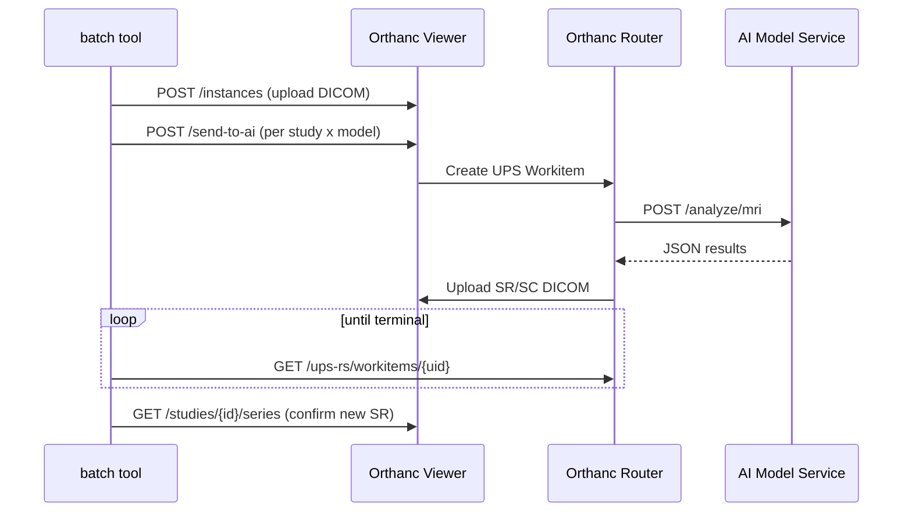

# Batch AI Analysis (Preloading Results)

This guide explains how to pre-compute AI results for a folder of studies, so that
during a clinical-evaluation reading session the results are already waiting in the
viewer rather than being submitted model-by-model by hand.

## Overview

The batch tool (`orthanc/batch/`) takes a folder of DICOM files, uploads them to the
viewer's Orthanc, and runs the **same send-to-AI flow the viewer UI uses** for every
`(study, model)` pair. It then verifies that each pair produced an AI result and writes
a report. It is designed for clinical evaluations where radiologists analyse AI
output but should not have to trigger the AI themselves.



## Prerequisites

- The **viewer stack** must be running (Orthanc Viewer reachable, default
  `http://localhost:8000`).
- The **model roster** must be up. Bring up the `odelia-models` compose profile and
  wait for health with:

  ```bash
  scripts/run-roster-tests.sh   # brings up the roster and health-waits
  ```

  or start the profile directly (see `docs/usage/adding_custom_models.md`).

## Usage

The tool needs `requests` (and `pydicom` when `--mapping` is used). Any environment
with `orthanc/requirements-tests.txt` installed has both — e.g. the repo's
`orthanc/.venv`. Run as a module from the `orthanc/` directory:

```bash
cd orthanc
.venv/bin/python -m batch --input /path/to/dicom-folder --models all --out report.json
```

### Options

| Flag | Default | Meaning |
|------|---------|---------|
| `--input` | *(required)* | Folder of DICOM files. Searched recursively; non-DICOM files are skipped. |
| `--models` | `all` | Comma-separated model names (e.g. `MST,agaldran`), or `all` for the whole roster. |
| `--base-url` | `$ORTHANC_VIEWER_BASE_URL` or `http://localhost:8000` | Viewer Orthanc base URL. |
| `--roster-host` | `$ROSTER_HOST` or `http://localhost` | Host used to poll router workitem state. |
| `--mapping` | *(none)* | Sequence mapping CSV for multi-series studies (see below). |
| `--data-raw` | `--input` | Root that the mapping's `SeriesPath` entries are relative to. |
| `--out` | *(none)* | Write the JSON report to this path. |
| `--timeout` | `900` | Seconds to wait for each workitem to reach a terminal state. |
| `--poll-interval` | `5` | Seconds between workitem-state polls. |

Available model names: `agaldran`, `BCN_AIM`, `DivideAndConquer`, `LME_ABMIL`, `MST`,
`Pimed` (the `odelia-models` roster).

## What it does

1. **Upload** — every DICOM file under `--input` is uploaded to the viewer's Orthanc.
   Orthanc groups instances into studies and de-duplicates by SOP Instance UID, so the
   tool is **idempotent**: re-running with the same input does not create duplicate
   studies.
2. **Resolve model input** — the model services declare three input configurations in
   their manifest (`multiphase`, `pre_post`, `subtraction`); the tool picks one per
   study and dispatches it explicitly via `input_configuration_id` + `input_mapping`:
   - with `--mapping`: a mapped `Sub_1` series selects `subtraction`; otherwise mapped
     `Pre` + `Post_1` series select `pre_post`;
   - without: a study with **exactly one** MR series (AI-result series excluded)
     selects `multiphase`;
   - anything ambiguous — several MR series and no mapping, or mapped series missing
     from the study — is reported as a failure and **never sent to a model**. The tool
     does not guess: a wrong Pre/Post pick would produce a plausible-looking but wrong
     subtraction.
3. **Trigger + poll** — for each `(study, model)` pair, it calls `/send-to-ai` and polls
   the resulting UPS-RS workitem until `COMPLETED` / `CANCELED` or the timeout.
4. **Validate** — it confirms a new SR series was written back into the study. A pair
   counts as *created* only when the workitem is `COMPLETED` **and** a new SR is present.

## Sequence mapping CSV

Sites whose studies keep pre/post contrast in **separate series** (rather than one
multi-phase series) must say which series plays which role. The mapping is data, not
config — one CSV row per series of interest:

```csv
PatientID,StudyInstanceUID,SequenceName,SeriesPath
P001,1.2.826...,Pre,P001/1.2.826.../1.3.46...
P001,1.2.826...,Post_1,P001/1.2.826.../1.3.46...
```

- `SeriesPath` is a directory relative to `--data-raw`, following the TCIA
  "classical" layout (`<PatientID>/<StudyInstanceUID>/<SeriesInstanceUID>/*.dcm`).
  The tool reads the actual `SeriesInstanceUID` from the DICOM files — folder names
  are never trusted.
- `SequenceName` uses the MediSwarm vocabulary: `Pre`, `Post_<n>`, `T2`, `Sub_1`.
- A `Sub_1` row (a scanner-computed subtraction series) takes precedence and is sent
  as the `subtraction` input; otherwise `Pre` + `Post_1` are sent as `pre_post` and
  the model service computes the subtraction itself.

## Report and exit code

The JSON report (`--out`) has the shape:

```json
{
  "ok": true,
  "uploaded_files": 155,
  "skipped_files": 0,
  "studies": [
    {
      "orthanc_study_id": "…",
      "study_uid": "…",
      "input_configuration_id": "multiphase",
      "input_series_uids": ["…"],
      "models": [
        {
          "model_name": "MST",
          "ai_name": "ODELIA MST init weights preview",
          "workitem_uid": "…",
          "final_state": "COMPLETED",
          "created": true,
          "new_sr_ids": ["…"],
          "elapsed_s": 42.1,
          "error": null
        }
      ]
    }
  ]
}
```

The process exits **0** only if every `(study, model)` pair was created; otherwise it
exits **1**, so it can gate a script or CI step. A one-line-per-pair summary is also
printed to stdout.

## Troubleshooting

| Symptom | Likely cause |
|---------|--------------|
| `final_state: CANCELED` | The model backend failed or rejected the input — check that service's logs. |
| `error: no MR series in study` | The study has no MR series (e.g. a non-MR fixture). |
| `error: … no mapping; cannot choose` | The study has several MR series; provide a `--mapping` row for it. |
| `error: mapped series not found in study` | The mapping's DICOM files were not uploaded (wrong `--data-raw`?) or name a different study. |
| `error: … did not reach a terminal state …` | The workitem timed out; raise `--timeout` or check the router/backend is healthy. |
| Many `skipped_files` | The input folder contains non-DICOM files; only DICOM is uploaded. |

## Testing

An end-to-end test against the bundled sample study lives at
`orthanc/tests/integration/test_batch_analyze.py` (marked `integration`). It uploads
`orthanc/sample_data/mri` and asserts MST produces an SR. It skips automatically when
the viewer stack or the MST roster pair is not running. The orchestration itself is
covered by fast unit tests in `orthanc/tests/unit/batch/`.
