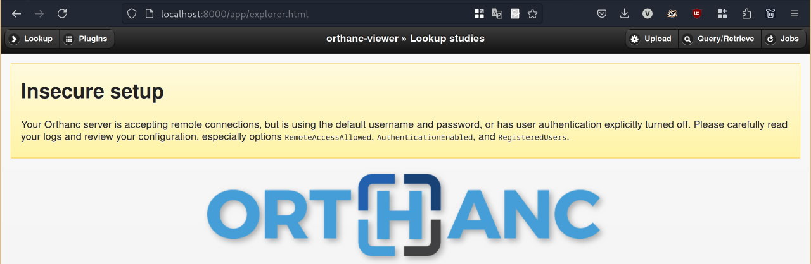
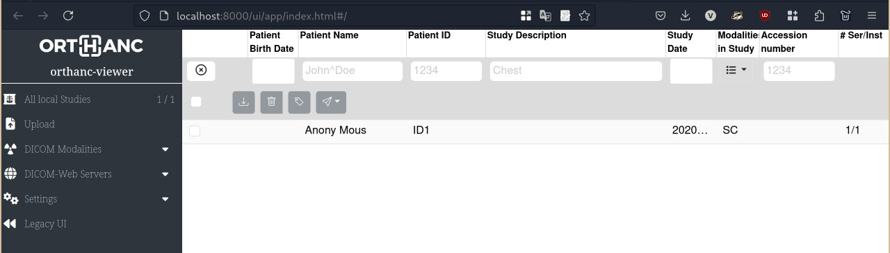
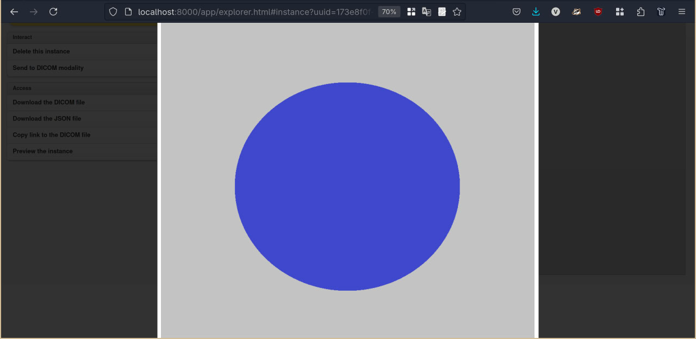
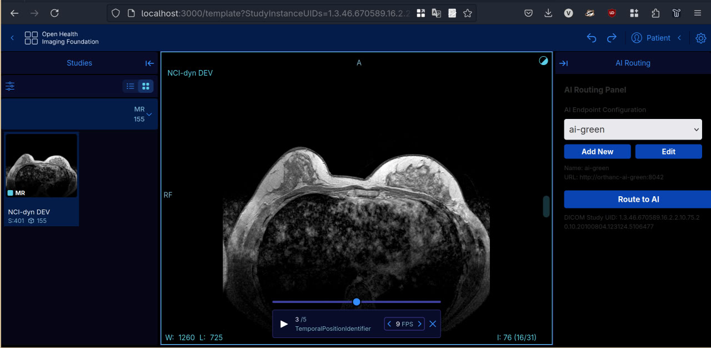
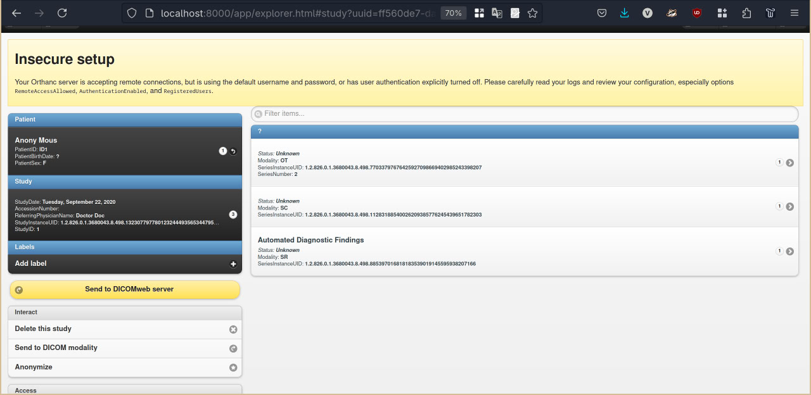
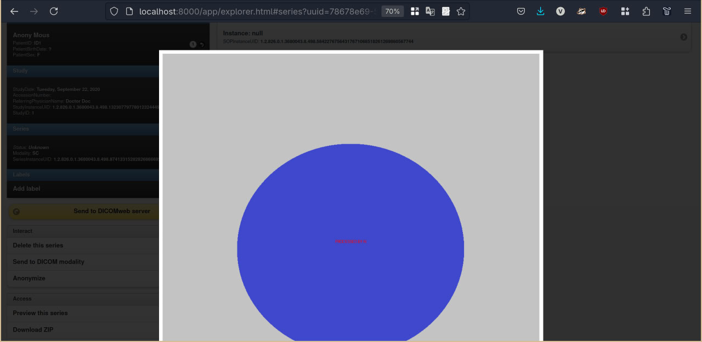
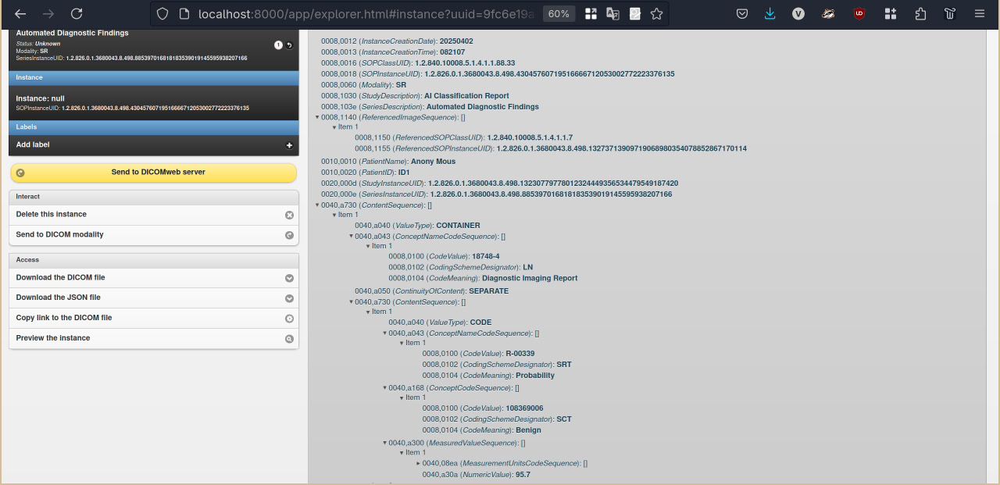
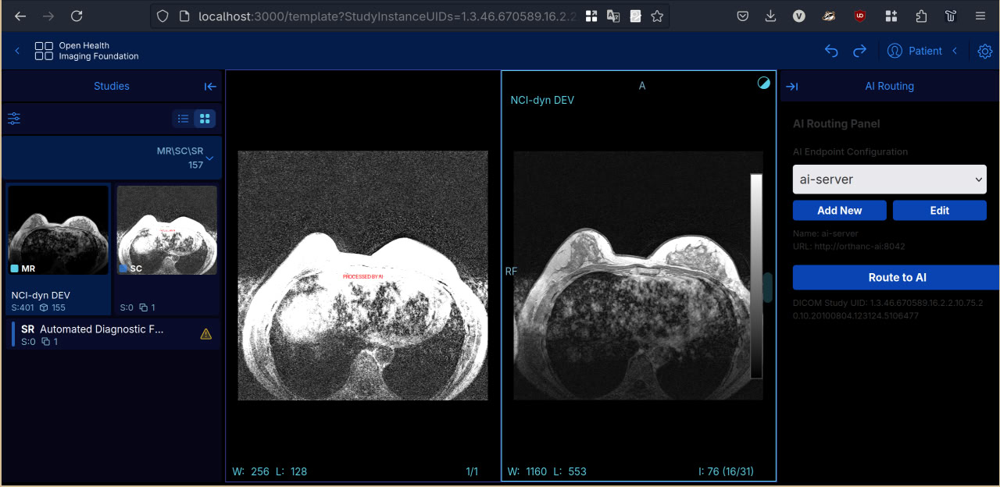

# Orthanc DICOM Routing with AI Integration

A demo project showcasing DICOM study routing between Orthanc servers: studies uploaded to the viewer's Orthanc are sent — on demand, from the ODELIA viewer — to a per-model AI router, which runs them through an AI model service and writes the results back as DICOM SR / Secondary Capture.

## Terms

- **Viewer Orthanc** (`orthanc-viewer`, http://localhost:8000) — the Orthanc instance the ODELIA viewer reads from. You upload studies here, and AI results are written back here.
- **AI Router** (`orthanc-router-mst` at http://localhost:8043, `orthanc-router-medgemma` at http://localhost:8044) — one Orthanc instance per model. When you send a study for processing, the router has the model pull the images via DICOMweb, then wraps the model's JSON output into DICOM SR / Secondary Capture (SC) and uploads it back to the Viewer Orthanc. The study itself is never copied to the router; only a UPS work-item is.
- **AI model service** (`mst-classifier` on port 5556, `medgemma-mri` on port 5557) — a Flask microservice that runs the model and returns JSON. It has no DICOM web UI.
- **ODELIA Viewer** (http://localhost:8081) — the web viewer. Its AI panel triggers processing and displays the results.

## Quick Test Guide

### 0. Start containers

This directory was historically a standalone repo (`orthanc-routing-example`); it is now part of the deployment. Build and run from the deployment root:

```bash
cd ..   # if you are inside orthanc/
docker compose up --build
```

### 1. Upload studies to the Viewer Orthanc

Use the Orthanc Explorer web interface at http://localhost:8000/app/explorer.html#upload to upload DICOM studies.

  
*Web interface for uploading DICOM files*

---

### 2. Verify the study in the Viewer Orthanc

Access Orthanc Explorer: http://localhost:8000/ui/app/index.html

  
*Studies list in the Viewer Orthanc*

  
*Original series in the Viewer Orthanc*

---

### 3. Send the study for AI processing

Open the study in the ODELIA viewer (http://localhost:8081) and use the AI panel to send it to a model. This is a manual, on-demand action — studies are **not** forwarded automatically when they stabilize.


*AI processing panel in the ODELIA Viewer*

Under the hood, the viewer creates a UPS work-item on the selected AI router, which orchestrates inference (calling the model service) and writes the results back to the Viewer Orthanc. The bundled `config/app-config.js` registers the MST router (`orthanc-router-mst`) in the panel by default; the MedGemma router is deployed too but must be added to `aiEndpoints` before it appears as a target.

---

### 4. Check the AI results

Because the router uploads its output back to the Viewer Orthanc, the results appear there and in the ODELIA viewer.

1. New AI result series (the SR/SC objects keep the original `StudyInstanceUID`, so they appear as new series under the same study)

*Mock AI results in the ODELIA Viewer*

2. Annotated image sequence (Secondary Capture)

*Mock visual AI result (SC) in the Orthanc Explorer*

3. Structured Report (SR) generated

*Mock SR AI result in the Orthanc Explorer*

4. View AI results in the viewer

*Viewing AI results in the ODELIA Viewer*
